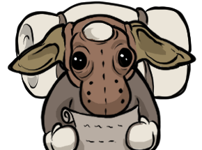

<p align="center">
  
</p>

# GobchatEx Roleplay Suite

A Dalamud plugin for Final Fantasy XIV via [XIVLauncher](https://github.com/goatcorp/FFXIVQuickLauncher).

> **This is third-party software.** I am not affiliated with Square Enix.
> Please do not discuss this plugin in-game. Reports about plugin behaviour
> belong here on GitHub or in the Dalamud Discord — never in `/sh`, `/yell`,
> or party chat where it puts other players at unnecessary risk.

## What it does

**RP highlighting** in the native chat log, for roleplayers: chat messages
in configured channels are recolored per segment —

- **Say** — quoted speech: `"…"`, `„…“`, `„…”`, `“…”`, `»…«`, `«…»`
- **Emote** — actions: `*…*`, `<…>`
- **OOC** — out-of-character: `((…))`
- **Mentions** — your own list of trigger words (case-insensitive whole
  words) plus per-character player-name matching: full/first/last name,
  opt-in partial (substring) matching, Miqo'te apostrophe segments, and
  typo-tolerant fuzzy matching with three strictness levels. Decorative
  "fancy font" text is unicode-folded before matching. Each trigger word can
  carry its own color/glow, overriding the default mention style. Optionally
  plays a game sound effect (`<se.1>`–`<se.16>`) or a custom sound file (wav,
  mp3, ogg vorbis/opus — with its own volume slider) with a per-sound
  cooldown. Your own messages don't alert — and by default aren't
  highlighted either (Echo is exempt, so `/echo` mention tests keep
  working). A recent-mentions window (toggle from the Quickbar) keeps the
  last 50 in a table for anything missed while away from the keyboard.

On `/say` and `/em`, text outside any delimiter counts as said or emoted
too — an unquoted `/say` line still renders in the Say color (while that
style is enabled). When a `/say` line mixes quotes with unquoted text
(`"hi" waves`), the unquoted rest is autodetected as an emote instead
(default on; optional for Party channels, off by default). Colors are free RGB values (color-picker swatches in the
config window; right-click a swatch to clear, each row has a
reset-to-default, and Say/Emote can import the color the game itself uses
for that channel). Delimiters may span item/player
links; an unclosed delimiter colors to the end of the message (matching the
original [GobchatEx](https://github.com/Shuro/GobchatEx) overlay's rules).
The message-rewriting approach follows
[ChatAlerts](https://github.com/Ottermandias/ChatAlerts). Design decisions
are recorded in [adr/](adr/); planned features migrating from the
standalone app are sequenced in [ROADMAP.md](ROADMAP.md).

**Player groups** recolor chat sender names per group: custom groups you
fill via right-click → Groups on any player name (also inside
[Chat 2](https://github.com/Infiziert90/ChatTwo)'s own context menu), the
`/gex group` command, or the settings tab — plus the game's seven
friend-list display groups (Star–Club). Custom groups take precedence over
friend groups. Each group can also play its own alert sound when a member
speaks (same game-effect/custom-file options as mentions, one shared
cooldown); if a message is both a mention and a group member speaking, only
the mention sound plays. The settings window itself is localized (English,
German), follows Dalamud's language unless overridden, and offers a few
selectable color themes.

**Range filter** fades chat from distant players: messages in configured
channels (default Say and both Emotes) darken in steps with distance and
render at the darkest step beyond the cut-off; mentions can bypass it so a
far-away ping still reads normally. A preview button in the Range tab draws
the two distances as rings on the ground around your character.

**Chat logging** writes chat to per-session `.log` files on demand — start
and stop from the Logs tab or the Quickbar; it never starts by itself and
always stops at logout. One file per login/character switch, configurable
folder (per-character subfolders optional) and channel selection.

**Quickbar** — a compact hotbar-like overlay with the chat-log start/stop
button and one-click toggles for the four features, with configurable hide
conditions (combat, cutscenes, loading screens, …) and an optional attach
mode that glues it to the top edge of the chat window (Chat 2's window when
present, otherwise the game's chat log).

## Commands

- `/gex` — Toggles the settings window (also reachable via
  `/xlplugins` → GobchatEx Roleplay Suite → ⚙, or the gear in the title
  bar). `/gobchatex` and `/gobchat` are aliases for `/gex`.
- `/gex help` — Prints the command list to chat.
- `/gex config open` — Opens (and focuses) the settings window.
- `/gex group list` — Prints your custom groups with their indices.
- `/gex group <n|name> <add|remove> Player Name [World]` — Adds or
  removes a player from the custom group with 1-based index `n` or the
  given name; the bracketed world is optional (a bare entry matches the
  name on any world). `... clear` empties the group; `g` is a shorthand
  for `group`.
- `/gex player count` / `/gex player list` — How many players are nearby /
  the nearby players with their distances. `p` is a shorthand for `player`.
- `/gex player distance Player Name [World]` — Your distance to one named
  nearby player.
- `/gex mention add|remove <word>` — Adds or removes a global mention
  trigger word (same dedupe rule as the Mentions tab). `/gex mention list` —
  Prints your current trigger words.
- `/gex log start|stop` — Starts or stops chat logging, same as the Logs tab
  or Quickbar button (still needs a log folder chosen first).
  `/gex log status` — Prints whether logging is on and, if so, the current
  session's file path.
- `<t>` in any of these resolves to your current target's name, even in
  macros (e.g. `/gex group 1 add <t>`).
- Anything unrecognized — including the old standalone app's retired
  commands — reports `Unknown command` instead of silently doing nothing.
- **Legacy macros:** with "legacy `/e gc` fallback" enabled under General
  (default on), the pre-Dalamud app's `/e gc <command>` echo form still
  works and routes to the same handlers.

## Installing

There's no official [DalamudPluginsD17](https://github.com/goatcorp/DalamudPluginsD17)
listing yet. Until then, install via this repo's custom plugin repository:

1. In-game: `/xlsettings` → Experimental → Custom Plugin Repositories.
2. Add: `https://raw.githubusercontent.com/Shuro/dalamud-plugins/main/repo.json`
3. `/xlplugins` → search "GobchatEx" → Install.

Custom repositories get minimal support from the Dalamud team itself — if
you hit an install issue, open a GitHub issue here first.

## Building locally

This project uses the `Dalamud.NET.Sdk`, which auto-references everything
needed (`Dalamud.dll`, `DalamudPackager`, `Dalamud.Bindings.ImGui`,
`FFXIVClientStructs`, `Lumina`, `InteropGenerator.Runtime`).

```sh
dotnet build
```

That produces `GobchatEx/bin/Debug/` — the plugin DLL plus its manifest
(`GobchatExPlugin.json`), icon, and the German satellite. (A Release build
additionally packs `bin/Release/GobchatExPlugin/latest.zip` for distribution —
not needed for dev loading.) To load it in-game:

1. `/xlsettings` → Experimental → "Dev Plugin Locations" → add the full path
   to `GobchatExPlugin.dll` inside that folder.
2. `/xlplugins` → Dev Tools → Installed Dev Plugins → enable.
3. While iterating, enable **Automatic Reloading** on the plugin's row
   under Installed Dev Plugins — Dalamud then reloads the plugin whenever
   `dotnet build` rewrites the DLL.

## Testing

The matching engine (`GobchatEx/Core/`) and the localization helper
(`GobchatEx/Localization/`) are Dalamud-free and covered by unit tests (no
game or XIVLauncher install needed):

```sh
dotnet test
# with coverage:
dotnet test --collect "Code Coverage;Format=cobertura"
```

Manual in-game smoke test (the Dalamud-facing layer is thin and validated
by hand). Setup: the **Echo** channel is *not* highlighted by default
(defaults: Say, Custom Emote, Party, Cross-world Party) — tick it in the
highlighted-channels list first, and add a mention trigger word. Then:

1. `/echo he said "hi" and *waves* ((brb)) YourTriggerWord` — expect the
   emote, OOC and mention segments to recolor. The default Say color is a
   soft white (`F8F8F8`), so quotes only stand out in channels whose base
   color isn't white. Also send an unquoted line with `/say` — the whole
   line renders in the Say color (unmarked `/say` text is implicitly Say;
   likewise `/em` and the Emote color). Then `/say "hi" waves` — the
   quoted part renders Say, the unquoted rest Emote (emote autodetect,
   Formatting tab).
2. Repeat with an item link (Ctrl-click an item into the message) inside the
   quotes — the link keeps working and the quote color resumes after it.
3. Send the line twice — the next chat line must render in normal colors
   (balanced color payloads).
4. Add a trigger word, enable the mention sound, have someone (or an alt)
   say it — sound plays, respecting cooldown and the "not for my own
   messages" toggle. Say the trigger yourself in `/say` — no highlight and
   no sound (own-message suppression, both default on); in `/echo` it
   still highlights.
5. Mentions tab → "Add Current Character" (it starts active), then
   `/echo Yourfirstname likes this` — your name recolors as a mention.
6. Right-click a player name in the chat log → Groups → add them to a
   custom group that has a color — their sender name recolors on their
   next chat line (group coloring skips Tell/Echo/Error, so use Say or
   Party).
7. Right-click the same player → Groups → untick the group — their next
   line renders in the normal sender color again. Re-add them by command:
   `/gex group list` prints the group indices, then
   `/gex group <n> add Player Name World` recolors them and
   `/gex group <n> remove Player Name World` clears it.
8. Put a friend (or an alt on your friend list) into one of the seven
   friend-list display groups (Star–Club) in the game's social window and
   give that friend group a color in the Groups tab — their sender name
   recolors. Add the same player to a colored custom group too — the
   custom group's color wins over the friend group's.
9. Change any setting and close the window right away — settings apply
   instantly and save automatically (no Save button; edits commit within
   half a second and closing flushes them). Rebuild (auto-reload) or
   toggle the plugin off and on — the change persists.
10. Range tab → enable the range filter with a short fade-out/cut-off, tick
    Say — have a distant alt say something: the line dims to a darkened
    step instead of your normal color, and vanishes (still visible, darkest
    step) once they're beyond the cut-off. Say something that mentions your
    trigger word from beyond the cut-off — with "mentions ignore range" on,
    it renders normally instead of dimmed. The Range tab also offers Custom
    Emote, Standard Emote, Yell and Shout — unformatted text on any of them
    fades using that channel's own configured Log Text Color (Character
    Configuration → Log Text Color) by default, darkened the same way, so
    Yell stays yellowish and Shout stays orange-red instead of collapsing
    into Say's grey; only channels with no game color configured fall back
    to a shared grey. If Chat 2 is currently installed *and loaded* and has
    its own customized color for that channel (its "Chat colours" page),
    that color is preferred instead — read directly from Chat 2's own
    config file, not live, so a color change there is picked up next time
    GEX's settings commit or you relog. Disabling or uninstalling Chat 2
    drops back to vanilla's color immediately (checked via Dalamud's
    installed-plugins list, not just whether the file exists — Chat 2's
    config file persists on disk even after it's disabled). Debug page →
    Range dimming → Step buttons
    demonstrate all of this directly without needing an alt: the
    "Unformatted text per channel" line prints one segment per channel in
    its own faded color, labeled with which source won (Chat 2 / vanilla /
    fallback). The Range tab's preview button draws a yellow (fade-out) and
    an orange (cut-off) ring around your character for ~8 seconds — check
    they match the slider distances.
11. Only if testing the Chat 2 styling integration (Milestone 3.5): load
    Chat 2's `local/dev-combined` fork build, open the ChatTwo tab in
    settings — it should show connected. Give a custom group a Chat 2
    background color: a group member's message gets that background in
    Chat 2's window (not the native log, which can't draw backgrounds).
    Repeat step 10's distance test with Chat 2 open — messages should fade
    to true partial transparency there instead of a darkened color step,
    stepping to the start opacity at the fade-out distance and ramping to
    the end opacity at the cut-off (sliders under Range → Chat 2).
    Separately (works with any Chat 2 build, not just the fork): customize
    a channel's color on Chat 2's own "Chat colours" page, leave another
    channel at default, then use step 10's Debug page buttons — the
    customized channel's segment should be labeled "(Chat 2)" and show that
    exact color faded; the untouched channel should still show "(vanilla)".

## Contributing

Issues and PRs welcome — development setup, commands, and the PR checklist
are in [CONTRIBUTING.md](CONTRIBUTING.md). If a PR involves AI assistance beyond autocomplete,
disclose it in the PR description using the official Dalamud AI policy's
levels ([dalamud.dev/plugin-publishing/ai-policy](https://dalamud.dev/plugin-publishing/ai-policy)):

- **None/Hint** — no AI, or autocomplete only. No disclosure needed.
- **Assist** — human-led; AI used for specific tasks on demand.
- **Pair** — active collaboration; roughly equal contribution.
- **Copilot** — AI implements; human plans and reviews.
- **Auto** — AI acts autonomously with minimal human direction.

Test your changes yourself and be able to explain what they do — "the AI
did it" isn't an acceptable answer during review. The official Dalamud
plugin repository ([DalamudPluginsD17](https://github.com/goatcorp/DalamudPluginsD17))
auto-rejects entirely AI-generated submissions and bans undisclosed AI use
in demonstrably AI-written work. See [AI-DISCLOSURE.md](AI-DISCLOSURE.md)
for this project's own AI-usage history.

## Credits

The plugin icon and the artwork on the in-game About page were illustrated by
[TsuShi Illustrations](https://tsushi-illustrations.carrd.co). Thank you!

## License

AGPL-3.0-or-later. See [LICENSE](../LICENSE).
